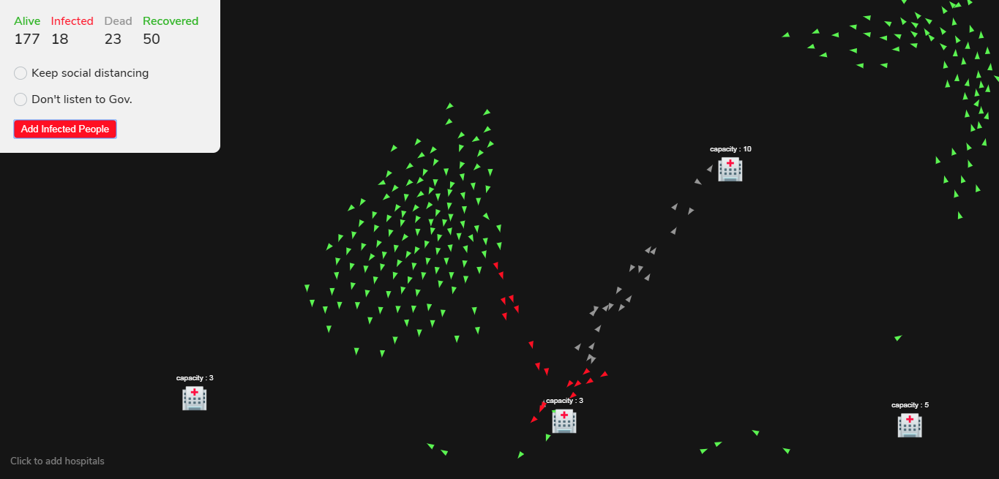

<br />
<p align="center">
  <a href="https://anuraghazra.github.io/covid19-sim">
    <h2 align="center">COVID-19 Simulation</h2>
    
  </a>

  <p align="center">
    <a href="https://anuraghazra.github.io/covid19-sim">View Demo</a>
    ·
    <a href="https://github.com/anuraghazra/covid19-sim/issues">Report Bug</a>
    ·
    <a href="https://github.com/anuraghazra/covid19-sim/issues">Request Feature</a>
  </p>
</p>

<p align="center">Coronavirus Simulation With Flocking System</p>

## Info

These Creatures are based on [Craig Reynold's](https://www.red3d.com/cwr/index.html) Steering Behaviors and [Flocking System](https://www.red3d.com/cwr/boids/)

It's also implements Genetic Algorithm and mutations.

You can learn more about them on Daniel Shiffman's YouTube Channel [The Coding Train](https://www.youtube.com/user/shiffman)

- [Coding Challenge #69.1: Evolutionary Steering Behaviors](https://www.youtube.com/watch?v=flxOkx0yLrY&t=1223s)

- [Coding Challenge #124: Flocking Simulation](https://www.youtube.com/watch?v=mhjuuHl6qHM&t=1978s)

- [9. Genetic Algorithm playlist The Nature of Code](https://www.youtube.com/playlist?list=PLRqwX-V7Uu6bJM3VgzjNV5YxVxUwzALHV)

## :rocket: Quick start

Start developing locally.

### Clone the repo

Fork the repository. then clone the repo locally by doing -

```sh
git clone https://github.com/anuraghazra/covid19-sim.git
```

## :v: Contributing

After cloning & setting up the local project you can push the changes to your github fork and make a pull request.

### Pushing the changes

```bash
git add .
git commit -m "feat: added new stuff"
```

---

Made with :heart: and Javascript
